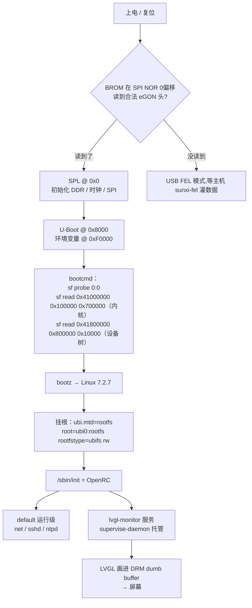
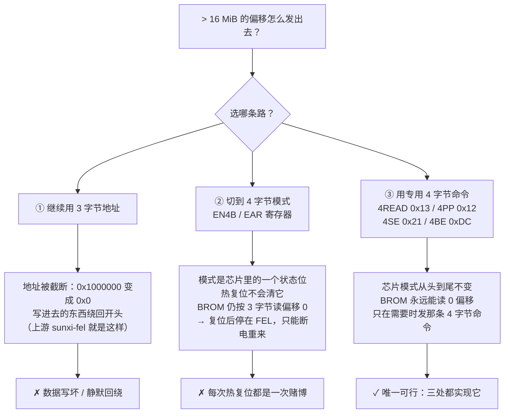
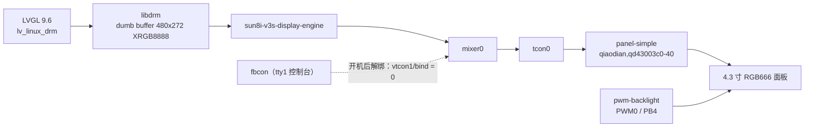
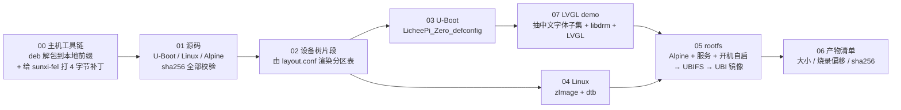
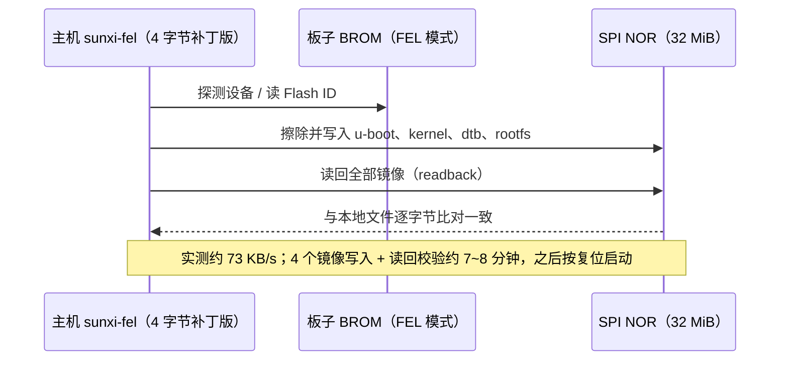
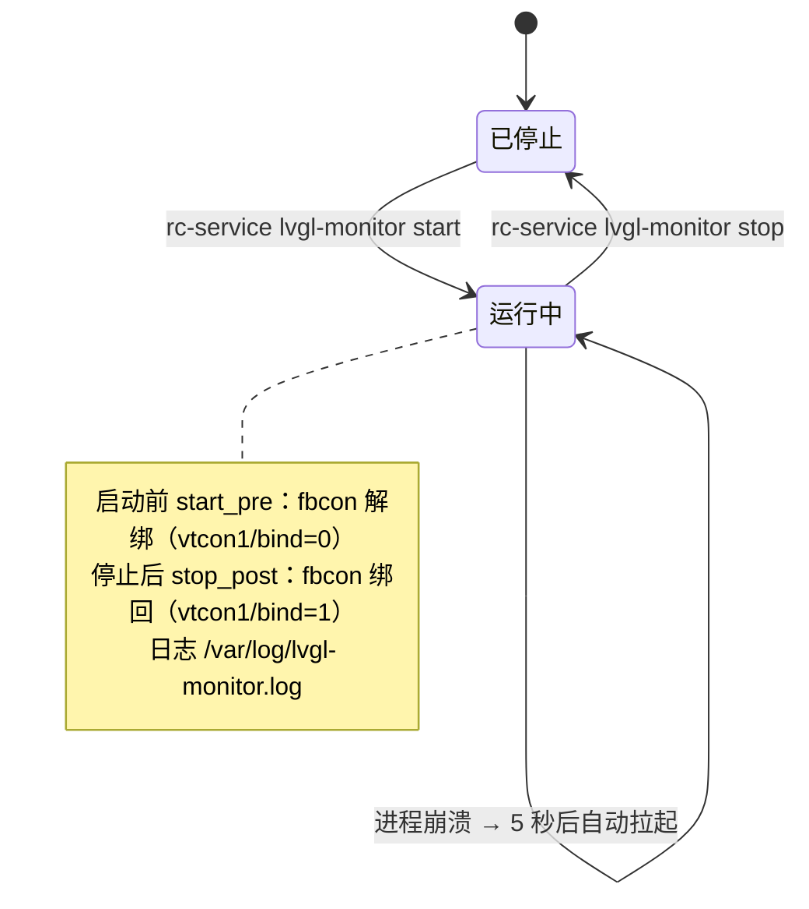

## LicheePi Zero: 32M norlfash + 主线 U-Boot + 主线 Linux + Alpine roots + LVGL 监控屏 

一台带4.3 寸小屏幕的国产linux 小开发板，从"原厂 BSP 镜像"改成全部上游代码：**主线 U-Boot、主线 Linux、**
**、Alpine rootfs，都存储在32M 的 spi norflash上**，顺手开机自启显示一块中文的 LVGL 系统监控面板。
全文的构建与烧录都是一条命令，本文记录**为什么这么做**、**坑在哪**、**怎么验证**。

> 本次调试与验证使用DeepSeek-V4.1-Flash模型协助完成

---

## 0. 先看成品


系统概况：

| 项 | 值 |
|---|---|
| SoC | Allwinner V3s（Cortex-A7 单核 1.008 GHz，片内 64 MB DDR2，Linux 可见 51 MB） |
| 开发板 | LicheePi Zero（ 百兆网口 + TF + USB-OTG） |
| Flash | **MX25L25645G，32 MiB SPI NOR** |
| Bootloader | 主线 **U-Boot 2026.07**（`LicheePi_Zero_defconfig` + 本地配置片段） |
| 内核 | 主线 **Linux 7.2.7** |
| 根文件系统 | **Alpine 3.24.2**（armv7），**UBIFS on UBI**，可读写 |
| 屏幕 | 通用 40P RGB LCD FPC座配4.3" 480x272 RGB 屏 + **LVGL 9.6** 直出 DRM/KMS，中文界面，常驻 RSS ≈ 1.0 MB |

为什么值得折腾：原厂 BSP 长期处于较老版本。换成主线之后，**全部代码来自上游**：U-Boot 官方、kernel.org、Alpine 官方镜像站，没有黑盒，可以继续往后迭代。

---

## 1. 从哪来、要什么

起点是 libcore 的那篇 LicheePi Zero 笔记（[blog.libcore.org/670](https://blog.libcore.org/670/)）：
它证明了 V3s 这颗芯片的主线支持是完整的（CCU、显示、以太网、USB 都在主线里）。
顺着这条路往下走，我给自己定了几个硬指标：

1. **全部上游**：U-Boot / Linux / rootfs 都不打"功能补丁"，只保留必要的板级配置；
2. **根文件系统挂在norflash上**：要能读写、能改配置、能存日志；
3. **可复现**：`./build.sh` 一条命令出全部镜像，`./flash.sh` 一条命令烧进去；
5. **屏幕要能用**：480x272 面板点起来，中文界面跑起来，开完机自启。

---

## 2. 启动链：从 BROM 到那块 LVGL 界面

先看全景。V3s 是 Allwinner 的"eGON"启动架构：**BROM 只认 SPI NOR 偏移 0 的 eGON 头**，
所以 SPL 必须躺在 0x0，U-Boot 紧跟其后（本方案放在 0x8000），环境变量塞在 1 MiB 分区的尾部：



几个刻意的设计决定：

* **U-Boot 不点屏。** 显示初始化全部交给 Linux 的 DRM 驱动树，U-Boot 只负责把内核和设备树搬进内存。
  这样屏幕时序、背光、色彩全在一处（设备树）维护，也不会出现"U-Boot 点了一次、内核再点一次闪一下"。
* **没有单独的 `u-boot-env` 分区。** 环境变量放在 u-boot 分区（1 MiB）尾部;
* **根分区是 UBI 上的 UBIFS。** V3s 的 SPI 控制器走的是 MTD，UBIFS 是
  MTD 上最合适的可读写文件系统（下面第 4 节讲为什么是UBIFS而不是JFFS2）。
* **FEL 是保底通道。** 不管 Flash 里被写成了什么，只要 BROM 读不到合法 eGON 头就会自动停在
  FEL 模式——这是永远不会砖的救援入口（本文所有烧录都走它）。

对应的分区表（仓库里 `board/layout.conf` 是唯一数据源，脚本会做 64 KiB 对齐检查）：

| 偏移 | 大小 | 内容 | 镜像实际占用 |
|---|---|---|---|
| `0x000000` | 1 MiB | SPL + U-Boot + 环境变量 | 409,032 B（39%） |
| `0x100000` | 7 MiB | `zImage`（原始内核镜像） | 5,492,912 B（74%） |
| `0x800000` | 64 KiB | 设备树 `sun8i-v3s-licheepi-zero-dock.dtb` | 13,821 B（21%） |
| `0x810000` | 23.94 MiB | UBI 卷 `rootfs`（UBIFS） | 8,650,752 B（34%） |

顺便解释一个常被问到的落差——**为什么 `df` 里的 20.3 MB 比分区小**：

| 层次 | 大小 | 依据 |
|---|---|---|
| NOR 上的 `rootfs` 分区 | 383 PEB × 64 KiB = **23.94 MiB** | 分区表 |
| UBI 卷 `rootfs` | 379 LEB × 65,408 B = **23.64 MiB** | 板子 sysfs：`reserved_ebs=379`、`data_bytes=24789632` |
| 挂载后 UBIFS 报的可用空间 | **20.3 MB** | `df`：B 树索引、日志区和垃圾回收的脏空间预留要占掉一部分 |

（383 个 PEB 里有 4 个被 UBI 自己拿走：内部 layout 卷等，用户卷就是剩下的 379 个 LEB。）

---

## 3. 32 MiB 的第一道坎：地址只有 3 个字节

16 MiB 是 SPI NOR 一个魔法边界：**3 字节地址最多寻址 16 MiB（0xFFFFFF）**。
一旦 Flash 大于 16 MiB，要么切成 4 字节地址模式，要么用"专用 4 字节命令"。
听起来只是改个参数，但这里有三条路，只有一条能在 V3s 上走通：



这条路要求**三个软件层各自会发 4 字节命令**，而且都不能去动芯片的全局状态：

| 层 | 做法 |
|---|---|
| **烧录工具** | 给上游 `sunxi-fel` 打补丁：`spiflash-read/write/erase` 遇到 `> 16 MiB` 的偏移时改用 4 字节命令，**不发 EN4B** |
| **U-Boot** | 给 `spi-nor-ids.c` 里 `mx25l25635e`（JEDEC ID `0xc22019`）那条加上 `SPI_NOR_4B_OPCODES` 标志（`drivers/mtd/spi/sf_internal.h` 里的 info flag），并关掉 `CONFIG_SPI_FLASH_BAR`；这样探测到容量 > 16 MiB 时 `spi_nor` 会调 `spi_nor_set_4byte_opcodes()` |
| **Linux** | 内核 `macronix.c` 里给同一个 ID 条目加 `.fixup_flags = SPI_NOR_4B_OPCODES`（**保险性质的**，原因见下） |

---

## 4. 分区与文件系统：UBI 上的 UBIFS

Flash 是 NOR FLASH，方案是标准的 **UBI + UBIFS**：

| 参数 | 值 | 说明 |
|---|---|---|
| PEB 大小 | 64 KiB | NOR 的物理擦除块 |
| `min_io_size` | 1 | NOR 可以按字节写 |
| `subpage_size` | 1 | 支持子页写 |
| `vid_hdr_offset` | 64 | UBI 元数据在每块里的位置 |
| LEB 大小 | 65,408 B | 64 KiB − 2 × 64 B UBI 头 |
| 总 PEB / 可用 LEB | 383 / **379** | 根分区 23.94 MiB 的账 |


### 那为什么不用 JFFS2？

JFFS2 不需要 UBI 层，同一棵 rootfs（11 MB / 440 个文件）实测镜像体积反而更小：
**JFFS2 5.76 MiB vs UBIFS 6.67 MiB**，等于多出 1 MB 可用空间。但还是选 UBIFS：

| | JFFS2 | UBIFS |
|---|---|---|
| 挂载 | Flash 上没有索引，**每次挂载都要扫描整个分区重建**（越用越慢；主线默认不开 summary） | 读 superblock + master + 索引，和用量无关 |
| 内存 | 每个节点都要对应的 RAM 结构，碎片化后膨胀（这台机器只有 64 MB RAM） | 索引缓存有界 |
| 小文件写入 | 节点式写入，写放大和碎片明显（`apk add` 正是这种负载） | 4 KiB 块打包 + B 树索引 |
| 磨损与升级 | 没有擦除计数；不支持原子卷更新 | UBI 统一管擦除计数；支持卷 rename/update（以后可以做 A/B 升级） |

---

## 5. 显示：为什么最后没用 `/dev/fb0`

板子上的 LVGL 一开始走的是老路：`/dev/fb0` + `lv_linux_fbdev`。能画，但很快就撞墙：

* V3s 主线的显示通路是 **DRM/KMS**（`sun8i-v3s-display-engine → mixer0 → tcon0 → panel-simple`），
  `/dev/fb0` 只是内核的 fbdev **模拟层**，多一层封装、少一堆能力（页翻转、双缓冲、plane 控制都要绕）；
* 最要命的是**同一个 CRTC 上不止一个 plane**。

改走 DRM 之后，程序只用 libdrm 的 5 个核心源文件编成静态库（不需要板子上装 libdrm、
不需要 GPU/GBM/EGL），直接申请 dumb buffer、LVGL 渲染进去、`PageFlip` 上屏：



**fbcon 抢屏是这次最难查的显示问题。** 症状非常有欺骗性：LVGL 说渲染成功、DRM 状态里也能看到
`allocated by = lvgl-monitor` 的 plane 挂在 CRTC 上，程序自己导出的帧是完整的中文界面，
**但物理屏幕上还是那行 tty 登录提示**。原因：

1. fbcon 在 V3s 上用的是 DRM 的 fbdev 模拟，它**有自己的 plane**，开机后就一直挂在同一个 CRTC 上；
2. 它的 **zpos 比 LVGL 的 plane 高**，所以永远盖在上面；
3. 解绑 fbcon（`echo 0 > /sys/class/vtconsole/vtcon1/bind`）**只让它不再重画，并不会关掉那块 plane**。

最后的修法是两条一起上：程序在第一次提交（`ALLOW_MODESET`）时把**同一个 CRTC 上其它 plane
全部设成 disabled**（`board/patches/lvgl-drm-hide-other-planes.patch`），
服务启动前再把 fbcon 从 tty1 解绑。之后 `drm state` 里就只剩 LVGL 一块 plane，
屏幕和导出的帧完全一致。

> **截图小技巧**：DRM 直出时画面不在 `/dev/fb0`。程序收到 `SIGUSR1` 会把当前正在扫描输出的那块
> dumb buffer 导成 PPM，`./demo/run-on-board.sh --shot x.png` 负责发信号、scp 回来、转 PNG。
> 本文所有界面图都是这么来的——**是屏幕上的真画面，不是模拟渲染**。

---

## 6. 屏幕上显示什么

界面每 500 ms 刷一次，数据全部来自 `/proc` 和 `/sys`，没有一个自造指标：

| 显示项 | 数据源 |
|---|---|
| 处理器占用率 | `/proc/stat` 两次采样求差 |
| **CPU 频率** | `/sys/kernel/debug/clk/clk_summary`（见下） |
| 内存 已用/剩余/缓存 | `/proc/meminfo` |
| 磁盘 已用/剩余 | `statvfs("/")` |
| 网络 ↓/↑ 速率 + 60 秒曲线 | `/sys/class/net/<iface>/statistics/{rx,tx}_bytes` |
| 运行时长 / 负载 / 时间 | `/proc/uptime`、`/proc/loadavg`、`clock_gettime` |

两个"查了半天才发现芯片就这样"的结论：

* **CPU 频率只能从时钟树读。** V3s 在主线里**没有 cpufreq 驱动**：DTS 里没有 `operating-points-v2`，
  `cpufreq-dt` 的白名单里也没有 V3s，H3 那套改 PLL 前先切 mux 的 notifier 在 V3s 的 CCU 驱动里同样没有。
  所以"开 `CONFIG_CPU_FREQ`"是没用的；正确的做法是读 CCU 时钟树里名为 `cpu` 的时钟
  （`grep '^ *cpu ' /sys/kernel/debug/clk/clk_summary` → `1008000000`）。
  程序里的顺序是：`scaling_cur_freq`（以后有驱动就自动用）→ `clk_summary` → 显示 `--`。
* **V3s 没有片上温度传感器，所以界面上不显示温度。** 数据手册的功能块清单里没有 THS/Thermal，
  主线的 `sun8i_thermal` 不支持 V3s，厂商 4.14 内核里也没有 `thermal_zone0`。

**中文界面**没有用现成的中文字库（一个 Noto Sans SC 就 10+ MB，放不进 23 MiB 的卷），
而是构建时用 `mkfont.py`（Pillow/FreeType）把界面里用到的汉字**抽成一个子集**，
生成 14/16/20 px 三套 4bpp 抗锯齿字体，作为 Montserrat 的 fallback：数字和英文仍走 Montserrat，
汉字走子集字体。整个二进制（含 libdrm + 三套字体）**988,792 字节**，运行时常驻 **RSS ≈ 1.0 MB**。

踩过的一个细节：LVGL 的 `SPARSE_TINY` cmap 表里，codepoint 必须写**相对值**，
而且 `range_length` 是"码点跨度"而不是"字符个数"——写错的话汉字会全部渲染成方框
（拉丁字母正常，所以很容易误判成"字体没加载"）。

---

## 7. 一步复现：`./build.sh`

需要的东西：一块 LicheePi Zero（Dock 更方便，有屏和网口）、焊接32MiB norflash、USB 线、能进 FEL 的板子。

详细的构建见仓库 [https://github.com/smilelc3/my_dev_board/blob/main/licheepi_zero/README.md](https://github.com/smilelc3/my_dev_board/blob/main/licheepi_zero/README.md)

所有东西都用一个入口构建，步骤之间的依赖是显式的



```bash
./build.sh              # 全流程（约 3 分钟）
./build.sh rootfs manifest   # 也可以只跑某几步，支持一次给多个步骤
./flash.sh info         # 看 FEL 设备 / 分区规划 / 本地镜像
./flash.sh write-all    # 烧 u-boot + kernel + dtb + rootfs（板子要在 FEL 模式）
./flash.sh check-32m    # 32 MiB 全片寻址自检（只读）
```

产物全都带 sha256 和烧录偏移，`out/MANIFEST.txt` 长这样：

```
u-boot-sunxi-with-spl.bin   409032  0x0       946497ab…  (占用分区 39%)
zImage                     5492864  0x100000  1be21d4a…  (占用分区 74%)
sun8i-v3s-…-dock.dtb         13821  0x800000  6c1d8b11…  (占用分区 21%)
rootfs.ubi                 8650752  0x810000  9d387831…  (占用分区 34%)
lvgl-monitor                988792  —         3360c9af…  (scp 到板子运行)
```

构建环境的硬规矩（都写在 `scripts/env.sh` 里）：

**烧录**走 USB FEL（板子跑着 Linux 时，它的 USB gadget 和 BROM 的 FEL **VID:PID 完全相同**，
都是 `1f3a:efe8`，用 `lsusb` 里的 `in FEL/flashing mode` 字样区分）：



---

## 8. 开机自启：把 demo 变成系统的一部分

最后一步是开机自启。镜像里直接装好了 OpenRC 服务：

| 项 | 值 |
|---|---|
| 程序 | `/usr/local/bin/lvgl-monitor`（静态 armv7，无运行时依赖） |
| 服务 | `/etc/init.d/lvgl-monitor`，`supervisor="supervise-daemon"` |
| 参数 | `/etc/conf.d/lvgl-monitor` 里的 `LVGL_MONITOR_ARGS`（`--detail` / `--fbdev` / 留空） |
| 运行级 | `default`，`rc-update add lvgl-monitor default` |
| 日志 | `/var/log/lvgl-monitor.log`（stdout + stderr） |
| 崩溃处理 | `supervise-daemon` 5 秒后自动拉起，无限次（`respawn_max=0`） |



`start_pre` 里那句 `echo 0 > /sys/class/vtconsole/vtcon1/bind` 是让屏幕的关键：
**启动时把 fbcon 从 tty1 解绑**（配合程序里禁用其它 plane 的补丁），
`stop_post` 再绑回来，所以 `rc-service lvgl-monitor stop` 就能把控制台还给屏幕，
不用重启、不用改配置。

## 9. 踩坑清单（都已在脚本/补丁里处理）

| 现象 | 真实原因 | 处理 |
|---|---|---|
| 16 MiB 以上写入后数据错乱 / 板子起不来 | 3 字节地址回绕，静默发生 | 三处都改用专用 4 字节命令；`./flash.sh check-32m` 自检 |
| LVGL 渲染成功但屏幕上还是 tty | fbcon 的 plane 挂在同一个 CRTC 上且 zpos 更高；解绑 fbcon 并不会关掉那块 plane | 第一次提交时禁用同 CRTC 的其它 plane + 启动前解绑 fbcon |
| 汉字全是方框，英文正常 | LVGL `SPARSE_TINY` cmap 要用**相对**码点，`range_length` 是码点跨度 | `mkfont.py` 生成时按此填写 |
| `apk add` 报证书不可信 / 时间不对 | 没有 RTC，开机时钟停在 1970 | `swclock` + 三层校时（NTP 真实 IP → NTP 域名 → HTTP Date），时区 `Asia/Shanghai` |
| 校时后时间差 8 小时 | busybox 的 `date -s` 把 GMT 字符串当本地时间 | 用 `date -u -D '%a, %d %b %Y %H:%M:%S GMT' -d "$d" +%s` 取 epoch，再 `date -s "@$e"` |


> 附录：构建打印
>
> ```
> root@ubuntu:~/my_dev_board/licheepi_zero# ./build.sh
> ==> out/lvgl-monitor 不在：按需补 sources/demo 并排在 rootfs 之前
> ==> ──── 00 自检主机工具链（系统装的）+ 编译 sunxi-fel ────
> ==> 00 自检主机工具链（root，uid=0）
>   ✓ arm-linux-gnueabihf-gcc    /usr/bin/arm-linux-gnueabihf-gcc
>   ✓ make                       /usr/bin/make
>   ✓ gcc                        /usr/bin/gcc
>   ✓ dtc                        /usr/bin/dtc
>   ✓ mkimage                    /usr/bin/mkimage
>   ✓ mkfs.ubifs                 /usr/sbin/mkfs.ubifs
>   ✓ ubinize                    /usr/sbin/ubinize
>   ✓ proot                      /usr/bin/proot
>   ✓ qemu-arm                   /usr/bin/qemu-arm
>   ✓ swig                       /usr/bin/swig
>   ✓ pkg-config                 /usr/bin/pkg-config
>   ✓ python3                    /usr/bin/python3
>   ✓ bc                         /usr/bin/bc
>   ✓ bison                      /usr/bin/bison
>   ✓ flex                       /usr/bin/flex
>   ✓ git                        /usr/bin/git
>   ✓ wget                       /usr/bin/wget
>   ✓ patch                      /usr/bin/patch
>   ✓ file                       /usr/bin/file
>   ✓ Python.h                   /usr/include/python3.14/Python.h
>   ✓ zlib.h                     /usr/include/zlib.h
>   ✓ ssl.h                      /usr/include/openssl/ssl.h
>   ✓ libusb.h                   /usr/include/libusb-1.0/libusb.h
>   ✓ libfdt.h                   /usr/include/libfdt.h
>   ✓ Pillow                     12.1.1
> ==>   自检通过：19 个命令 + Python.h + 4 个头文件 + Pillow
> ==> 克隆 sunxi-tools
> Cloning into '/root/my_dev_board/licheepi_zero/build/src/sunxi-tools'...
> remote: Enumerating objects: 95, done.
> remote: Counting objects: 100% (95/95), done.
> remote: Compressing objects: 100% (86/86), done.
> remote: Total 95 (delta 20), reused 37 (delta 7), pack-reused 0 (from 0)
> Receiving objects: 100% (95/95), 144.64 KiB | 698.00 KiB/s, done.
> Resolving deltas: 100% (20/20), done.
> ==>   给 sunxi-tools 打 4 字节地址补丁（32 MiB flash 全片可烧）
> ==> 编译 sunxi-tools/sunxi-fel
> ==> sunxi-fel OK: /root/my_dev_board/licheepi_zero/build/src/sunxi-tools/sunxi-fel
> ==> 00 完成
> ==> ──── 01 下载并校验 U-Boot / Linux / Alpine 源码 ────
> ==> 下载 u-boot-2026.07.tar.bz2  ←  https://ftp.denx.de/pub/u-boot/u-boot-2026.07.tar.bz2
> /root/my_dev_board/licheepi_zero/build/sr 100%[====================================================================================>]  33.41M   117KB/s    in 4m 17s  
> ==> 下载 linux-7.2.7.tar.xz  ←  https://mirrors.tuna.tsinghua.edu.cn/kernel/v7.x/linux-7.2.7.tar.xz
> /root/my_dev_board/licheepi_zero/build/sr 100%[====================================================================================>] 152.89M  80.6MB/s    in 1.9s    
> ==> 下载 alpine-minirootfs-3.24.2-armv7.tar.gz  ←  https://dl-cdn.alpinelinux.org/alpine/v3.24/releases/armv7/alpine-minirootfs-3.24.2-armv7.tar.gz
> /root/my_dev_board/licheepi_zero/build/sr 100%[====================================================================================>]   3.03M   427KB/s    in 5.1s    
> ==> 下载 lvgl-9.6.0.tar.gz  ←  https://github.com/lvgl/lvgl/archive/refs/tags/v9.6.0.tar.gz
> /root/my_dev_board/licheepi_zero/build/sr 100%[====================================================================================>] 106.30M   930KB/s    in 2m 31s  
> ==> 下载 libdrm-2.4.134.tar.xz  ←  https://dri.freedesktop.org/libdrm/libdrm-2.4.134.tar.xz
> /root/my_dev_board/licheepi_zero/build/sr 100%[====================================================================================>] 427.00K   280KB/s    in 1.5s    
> ==> 下载 NotoSansSC-Regular.otf  ←  https://raw.githubusercontent.com/notofonts/noto-cjk/main/Sans/SubsetOTF/SC/NotoSansSC-Regular.otf
> /root/my_dev_board/licheepi_zero/build/sr 100%[====================================================================================>]   7.95M   821KB/s    in 8.0s    
> ==> 解包 u-boot-2026.07.tar.bz2
> ==> 解包 linux-7.2.7.tar.xz
> ==> 解包 lvgl-9.6.0.tar.gz
> ==> 解包 libdrm-2.4.134.tar.xz
> ==>   给 U-Boot 打 4 字节 opcode 补丁
> ==>   给内核打 4 字节 opcode 补丁
> ==>   给 LVGL 的 DRM 驱动打补丁（隐藏同 CRTC 上 fbcon 的 plane）
> ==> 01 完成：源码就绪
>   /root/my_dev_board/licheepi_zero/build/src/libdrm-2.4.134
>   /root/my_dev_board/licheepi_zero/build/src/linux-7.2.7
>   /root/my_dev_board/licheepi_zero/build/src/lvgl-9.6.0
>   /root/my_dev_board/licheepi_zero/build/src/sunxi-tools
>   /root/my_dev_board/licheepi_zero/build/src/u-boot-2026.07
>   /root/my_dev_board/licheepi_zero/build/src/NotoSansSC-Regular.otf
> ==> ──── 02 给 U-Boot 与 Linux 打设备树片段 ────
> ==> 02 从 layout.conf 生成设备树片段
>   [++] 追加板级片段：/root/my_dev_board/licheepi_zero/build/src/u-boot-2026.07/dts/upstream/src/arm/allwinner/sun8i-v3s-licheepi-zero-dock.dts
>   [++] 追加板级片段：/root/my_dev_board/licheepi_zero/build/src/linux-7.2.7/arch/arm/boot/dts/allwinner/sun8i-v3s-licheepi-zero-dock.dts
> ==> 02 完成：设备树片段已生成并追加（分区 0x0/0x100000/0x800000/0x810000）
> ==> ──── 03 编译 U-Boot ────
> ==> 03 构建 U-Boot 2026.07
>   spl/u-boot-spl.bin              17064 bytes
>   u-boot.bin                     376200 bytes
>   u-boot-sunxi-with-spl.bin      409032 bytes
>   u-boot.dtb                      18680 bytes
> ==> 03 完成：out/u-boot-sunxi-with-spl.bin (409032 bytes)
> ==> ──── 04 编译 Linux 内核 + 设备树 ────
> ==> 04 构建 Linux 7.2.7
>   arch/arm/boot/dts/allwinner/sun8i-v3s-licheepi-zero-dock.dtb        13821 bytes
>   arch/arm/boot/zImage                                              5492864 bytes
> ==> 04 完成：out/zImage (5492864 bytes), out/sun8i-v3s-licheepi-zero-dock.dtb (13821 bytes)
> ==> ──── 07 构建 LVGL 系统监控 demo(静态 armv7 可执行文件) ────
> ==> 07 构建 LVGL 9.6.0 系统监控 demo
> ==>   生成中文字体子集 + 编译 libdrm + LVGL（483 个源文件），静态链接
> ==> 07 完成：out/lvgl-monitor (988792 bytes)
>   推到板子上跑： scp out/lvgl-monitor 板子: && ssh 板子 sudo /usr/local/bin/lvgl-monitor
>   （镜像里已经装好这个二进制，开机自启，一般不用手动跑）
> ==> ──── 05 构建 Alpine rootfs + UBIFS/UBI 镜像 ────
> ==> 05 构建 Alpine 3.24.2 rootfs（分区 383 PEB -> 卷 379 LEBs = 23 MiB）
> ==>   用 /usr/bin/qemu-arm 跑 arm 用户态（proot）
> ==>   apk add alpine-base openrc openssh-server openssh-sftp-server sudo（必需）
> ==>   写板级配置（含时区 Asia/Shanghai / 东八区）
> ==>   OpenRC 服务与 root 口令
> ==>   清理
>     根文件系统内容大小: 15M
> ==>   mkfs.ubifs -c 379（root 直接 chown 成 root 属主）
> ==>   ubinize -> out/rootfs.ubi
>     rootfs.ubifs:  8503040 bytes (8303 KiB；卷 379 LEBs / 23.64 MiB，首次挂载自动扩到满)
>     rootfs.ubi  :  8650752 bytes (8448 KiB，写到 NOR 偏移 0x810000)
>     rootfs 分区 24512 KiB，镜像占 8448 KiB（余量 16064 KiB）
> [!] 镜像写到了 16 MiB 以上（0x1050000）：
>       上游原版 sunxi-fel 会地址回绕，必须用本仓库 00-host-tools.sh 编出来的（已打 4 字节补丁）
> ==> 05 完成：out/rootfs.ubi
> ==> ──── 06 生成产物清单 ────
> ==> 分区对齐检查（擦除块 64 KiB）
>   u-boot   偏移 0x0        大小 0x100000   ✓
>   kernel   偏移 0x100000   大小 0x700000   ✓
>   dtb      偏移 0x800000   大小 0x10000    ✓
>   rootfs   偏移 0x810000   大小 0x17f0000  ✓
> ==> 分区一致性检查：内核 dtb 与 u-boot.dtb 的 SPI NOR 分区一致 ✓
> # LicheePi Zero Dock (V3s) 构建产物清单
> # 生成时间: 2026-10-07T15:25:11Z
> # U-Boot 2026.07 / Linux 7.2.7 / Alpine 3.24.2
> #
> # 文件                                     大小  烧录偏移 sha256
> u-boot-sunxi-with-spl.bin                    409032  0x0        946497abb8a5f402bb2359ab55bff7e26449017849d450efd88891db55972269  (占用分区 39%)
> zImage                                      5492864  0x100000   1be21d4aecdd3fa0ffe6193806123c75fb5c69efc19ef45d89e8700140dd8451  (占用分区 74%)
> sun8i-v3s-licheepi-zero-dock.dtb              13821  0x800000   6c1d8b11d2c31bfe65e609d68962a67324b01009735857a4d62281154d4fea6c  (占用分区 21%)
> rootfs.ubi                                  8650752  0x810000   6c8675cca1f21c571bb283b525dfe2d068c43503c312dc3348e2caf289618015  (占用分区 34%)
> lvgl-monitor                                 988792  —        3360c9afe016dfa29d1c1ed3bf625b6ecb7a00efed30aec7d7c70f20b57c9686  (scp 到板子运行，不烧 NOR)
> ==> 06 完成：out/MANIFEST.txt
> 
> ==> 构建完成，用时 10 分 22 秒
> 
> ==> 产物（out/）：
>   total 23508
>   drwxr-xr-x 1 root root      218 Oct  7 23:25 .
>   drwxr-xr-x 1 501  staff     118 Oct  7 23:02 ..
>   -rw-r--r-- 1 root root      966 Oct  7 23:25 MANIFEST.txt
>   -rwxr-xr-x 1 root root   988792 Oct  7 23:24 lvgl-monitor
>   -rw-r--r-- 1 root root  8650752 Oct  7 23:25 rootfs.ubi
>   -rw-r--r-- 1 root root  8503040 Oct  7 23:25 rootfs.ubifs
>   -rw-r--r-- 1 root root    13821 Oct  7 23:24 sun8i-v3s-licheepi-zero-dock.dtb
>   -rw-r--r-- 1 root root   409032 Oct  7 23:22 u-boot-sunxi-with-spl.bin
>   -rw-r--r-- 1 root root  5492864 Oct  7 23:24 zImage
> 
> ==> 下一步： ./flash.sh info   然后  ./flash.sh write-all  /  ./flash.sh fel-boot
> ```
>
> 

---

## 参考

* [libcore 的 LicheePi Zero 笔记](https://blog.libcore.org/670/)
* [Lichee Pi Zero 硬件资料与原理图（Lichee-Pi/lichee-pi-zero）](https://github.com/Lichee-Pi/lichee-pi-zero)
* [linux-sunxi wiki：V3s / SPI NOR / UBI](https://linux-sunxi.org/)
* [Allwinner V3s Datasheet V1.0](https://linux-sunxi.org/images/archive/2/23/20230923150329%21Allwinner_V3s_Datasheet_V1.0.pdf)
* 上游项目：[U-Boot](https://u-boot.org/)、[Linux](https://kernel.org/)、[Alpine Linux](https://alpinelinux.org/)、
  [LVGL](https://lvgl.io/)、[sunxi-tools](https://github.com/linux-sunxi/sunxi-tools)
